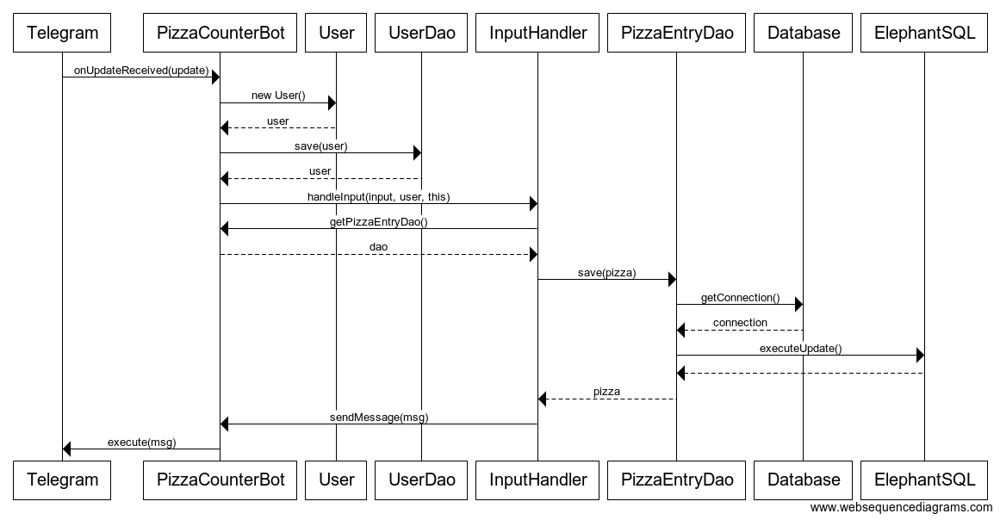

## Arkkitehtuurikuvaus

### Rakenne

Ohjelman rakenne noudattaa osaksi kolmitasoista kerrosarkkitehtuuria. `telegrambot.bot` -pakkaus hoitaa sovelluksen käynnistyksen ja yhteyden Telegramiin. `telegrambot.domain` -pakkaus hoitaa käyttäjän lähettämien viestien purkamisen ja niihin reagoimisen, domain tarvitsee kylläkin myös bottia lähettäessä viestiä käyttäjälle. Pakkaus `telegrambot.dao` huolehtii yhteydestä tietokantaan.

### Käyttöliittymä

Telegramin käyttöliittymä. Viestit lähetetään botille, kuten kenelle tahansa muulle henkilölle Telegramissa. Komennot käsitellään toisistaan erillisinä.

### Tietojen pysyväistallennus

Alunperin sovelluksen oli tarkoitus käyttää DAO-suunnittelumallia, mutta päädyin poistamaan interfacen, koska User ja PizzaEntry -luokat tarvitsivat erilaisia tietokantatoimintoja. Sovellusta on mahdollista käyttää paikallisesti SQLitellä tai pilvipalveluna PostgreSQL-tietokantana. Käytän itse palvelua ElephantSQL.

## Sovelluslogiikka

## Pizzan lisääminen

